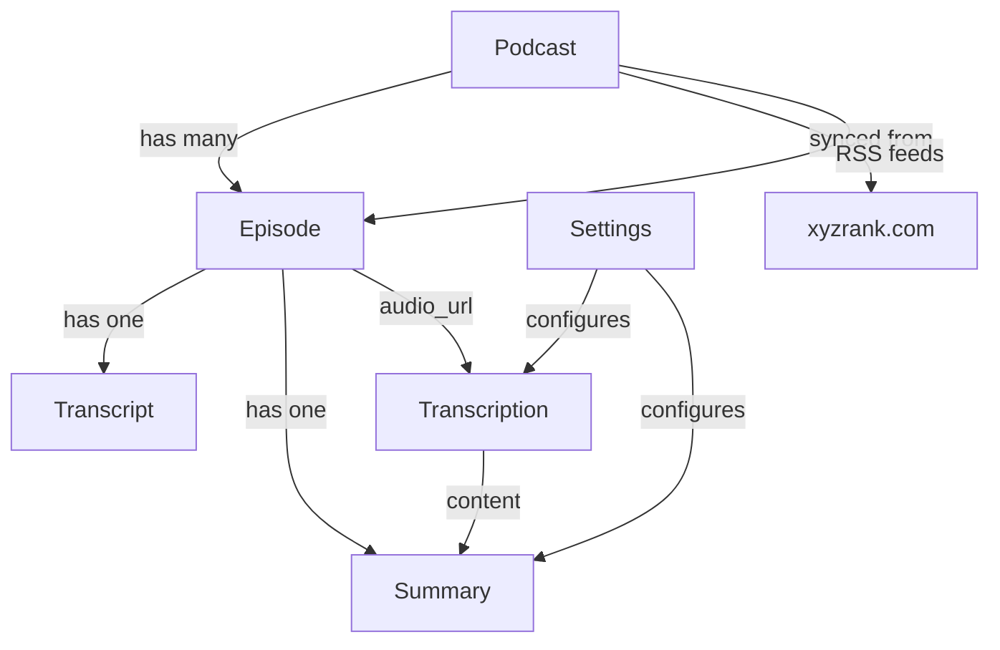

# PodcastInsight — Domain Context

## Domain Overview

PodcastInsight is organized into four core domains following Domain-Driven Design principles. Each domain represents a distinct business area with its own models, rules, and boundaries.

## 1. Podcast Domain

### Purpose
Fetches podcast rankings from xyzrank.com, monitors RSS feeds for new episodes, and manages podcast/episode data.

### Core Entities
- **Podcast**: Podcast synced from xyzrank.com
  - Attributes: id, xyzrank_id, name, rank, logo_url, category, author, rss_feed_url, track_count, avg_duration, avg_play_count, is_tracked
  - Invariants: xyzrank_id must be unique
- **Episode**: Episode parsed from RSS feed
  - Attributes: id, podcast_id, title, description, audio_url, duration, published_at, transcript_status, summary_status
  - Statuses: pending, processing, completed, failed
- **PodcastRankingHistory**: Historical ranking data
  - Attributes: id, podcast_id, rank, avg_play_count, recorded_at

### Key Business Rules
1. Rankings synced daily from xyzrank.com API (top 1000)
2. Episodes checked every 6 hours for tracked podcasts
3. Only tracked podcasts trigger episode monitoring
4. Ranking history preserved for trend analysis

### Domain Services
- PodcastService: Ranking sync, podcast CRUD
- EpisodeService: Episode sync from RSS, episode CRUD

### Celery Tasks
- sync_rankings: Daily ranking sync from xyzrank.com
- sync_episodes: Periodic episode discovery from RSS feeds

### Current Implementation Status
- ✅ xyzrank.com ranking sync (top 1000)
- ✅ RSS feed parsing with feedparser
- ✅ Episode monitoring for tracked podcasts
- ✅ Ranking history tracking

## 2. Transcription Domain

### Purpose
Handles audio transcription using Whisper (API or local GPU-accelerated).

### Core Entities
- **Transcript**: Transcription result
  - Attributes: id, episode_id, content, language, word_count, model_used

### Key Business Rules
1. Audio downloaded → ffmpeg chunking → Whisper transcription
2. Status tracking: pending → processing → completed/failed
3. Retry logic with exponential backoff (max 3 retries)
4. Configurable Whisper model via settings

### Domain Services
- TranscriptionService: Orchestrates transcription pipeline

### Celery Tasks
- transcribe_episode: Background transcription task

### Current Implementation Status
- ✅ Whisper API integration
- ✅ faster-whisper local GPU support
- ✅ Status tracking and retry logic
- ✅ Audio download and chunking

## 3. Summary Domain

### Purpose
Generates AI-powered episode summaries using configurable LLM providers.

### Core Entities
- **Summary**: AI-generated summary
  - Attributes: id, episode_id, content, key_topics, highlights, model_used, provider

### Key Business Rules
1. Support multiple providers: OpenAI, DeepSeek, OpenRouter, custom endpoints
2. Summary includes: key topics, highlights, takeaways
3. Background processing with status tracking
4. Provider configured via Settings domain

### Domain Services
- SummaryService: Orchestrates summarization pipeline

### Celery Tasks
- summarize_episode: Background summarization task

### Current Implementation Status
- ✅ Multi-provider support (OpenAI, DeepSeek, OpenRouter)
- ✅ Custom OpenAI-compatible endpoint support
- ✅ Key topics and highlights extraction
- ✅ Background processing with status tracking

## 4. Settings Domain

### Purpose
Manages AI provider API keys (encrypted at rest) and model configurations.

### Core Entities
- **AIProviderConfig**: Provider configuration
  - Attributes: id, provider_name, base_url, encrypted_api_key, is_default
- **AIModelConfig**: Model configuration per provider
  - Attributes: id, provider_id, model_name, temperature, max_tokens, is_default

### Key Business Rules
1. API keys encrypted at rest using Fernet
2. Support multiple providers simultaneously
3. One default provider and model at a time
4. Connectivity test endpoint available

### Domain Services
- SettingsService: Provider CRUD, encryption, connectivity testing

### Current Implementation Status
- ✅ Fernet encryption for API keys
- ✅ Multi-provider CRUD
- ✅ Model configuration per provider
- ✅ Connectivity testing

## Cross-Domain Relationships

## Domain Events

### Podcast Events
- RankingsSynced
- PodcastTracked
- PodcastUntracked
- EpisodesDiscovered

### Transcription Events
- TranscriptionStarted
- TranscriptionCompleted
- TranscriptionFailed

### Summary Events
- SummaryStarted
- SummaryCompleted
- SummaryFailed

### Settings Events
- ProviderCreated
- ProviderUpdated
- ProviderDeleted
- ConnectivityTested

## Shared Kernel

### Value Objects (shared across domains)
- PodcastId
- EpisodeId
- ProviderId
- Timestamp
- ProcessingStatus (pending, processing, completed, failed)

### Common Services
- CeleryTaskManager: Background task coordination
- EncryptionService: Fernet encryption/decryption
- AudioProcessor: Audio download and chunking
- RSSParser: RSS feed parsing

## Implementation Guidelines

1. **Respect Domain Boundaries**: Never directly access another domain's repositories
2. **Use Celery Tasks for Async**: Long-running operations go through Celery
3. **Maintain Invariants**: Each domain enforces its own business rules
4. **Test Domain Logic**: Unit test all business rules and invariants
5. **Encrypted at Rest**: All API keys must use Fernet encryption

Remember: Each domain has its own expert. When working on features spanning multiple domains, collaborate with the appropriate domain specialists.
